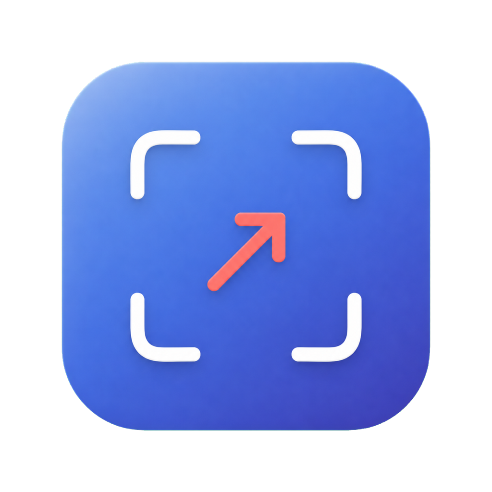

# CaptureMark

[简体中文](README.md) | English

CaptureMark is a lightweight, native macOS screenshot annotation utility built entirely with AppKit. It lives in the menu bar and makes it quick to capture screen content and add text or arrows.



## Features

- Select and capture an area across multiple displays with the default global `⌘⇧6` shortcut; press `Esc` to cancel
- Automatically copy the original capture when using the global shortcut, ready to paste immediately or annotate further
- Change the shortcut from the “Capture Shortcut” submenu in the menu bar; the choice is persisted
- Click to add text with an editor that automatically adjusts to the selected font size
- Press Return or click outside the editor to confirm text
- Double-click confirmed text with the Select or Text tool to edit it again
- Change the color and size of text and arrows
- Keep text and arrow outlines off by default, or configure each outline and its color independently
- Drag to draw arrows
- Select and delete annotations, with undo and redo support
- Copy the composed image to the clipboard
- Export PNG files at the original screenshot resolution

## Download and Use

Download the latest `macOS-universal.zip` from [GitHub Releases](https://github.com/jason-mao/CaptureMark/releases), extract it, and open `CaptureMark.app`.

macOS will request Screen Recording permission the first time you capture the screen:

1. Open System Settings → Privacy & Security → Screen & System Audio Recording.
2. Allow CaptureMark to record the screen.
3. Quit CaptureMark completely, then reopen it.

CaptureMark registers `⌘⇧6` by default; it does not disable the system `⌘⇧3`, `⌘⇧4`, or `⌘⇧5` screenshot shortcuts. Choose another combination from the “Capture Shortcut” submenu under the CaptureMark menu bar icon. If the new combination is occupied, CaptureMark keeps the previous shortcut and reports the conflict.

Note: On older Macs with a Touch Bar, macOS uses `⌘⇧6` to capture the Touch Bar by default. Choose another combination directly from CaptureMark’s “Capture Shortcut” submenu.

Apps attached to Releases are ad-hoc signed and are not yet signed or notarized with an Apple Developer ID. If macOS blocks the app on first launch, right-click it in Finder and select “Open.” Replacing or rebuilding the app may require granting Screen Recording permission again.

## Local Development

Requirements: macOS 13 or later and Xcode 15 / Swift 5.10 or later.

```bash
git clone https://github.com/jason-mao/CaptureMark.git
cd CaptureMark
swift run CaptureMark
```

Package an `.app` for the current architecture:

```bash
./Scripts/package_app.sh release
open dist/CaptureMark.app
```

Package a universal `.app` for both Apple Silicon and Intel:

```bash
CAPTUREMARK_UNIVERSAL=1 ./Scripts/package_app.sh release
```

## Versioning and Releases

The project follows [Semantic Versioning](https://semver.org/). `VERSION` is the single source of truth, and Git tags use the matching `vMAJOR.MINOR.PATCH` format.

Release procedure:

```bash
# Update VERSION and CHANGELOG.md first, then commit the changes.
version="$(tr -d '[:space:]' < VERSION)"
git tag -a "v$version" -m "CaptureMark $version"
git push origin main --follow-tags
gh release create "v$version" --verify-tag --generate-notes --title "CaptureMark $version"
```

After a Release is published, GitHub Actions validates its tag against `VERSION`, builds a universal macOS app, and uploads the ZIP archive and its SHA-256 checksum to that Release.

## License

This project is available under the [MIT License](LICENSE).
